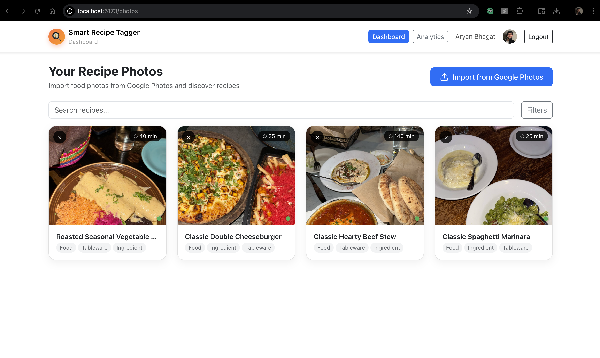
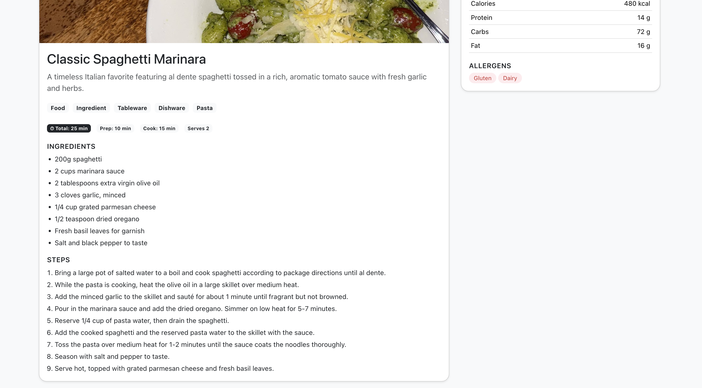
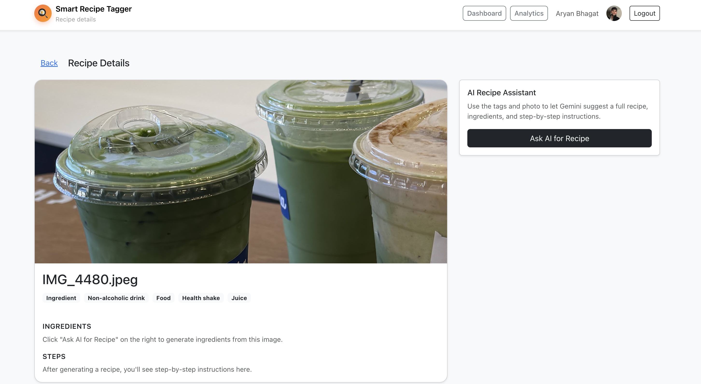
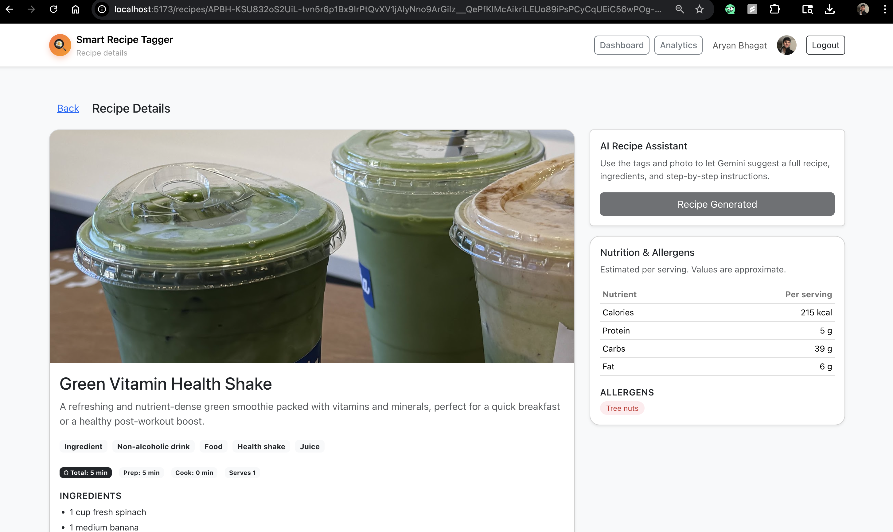
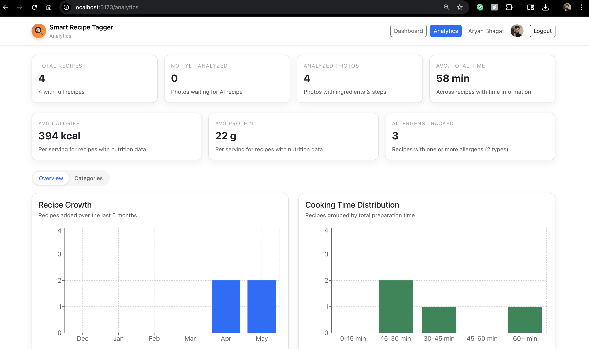
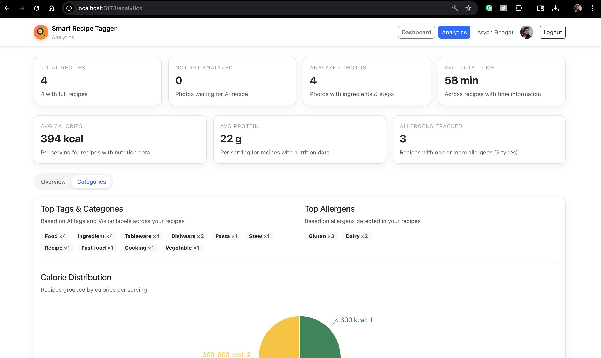

# Smart Recipe Tagger

## Issues, Concerns or Comments: aryanbhagat5702@gmail.com 

A web application that allows users to sign in with Google, connect to their Google Photos, and discover recipes from food images using AI.

## 📸 Demo Screenshots

### Login Page

### Dashboard & Photo Gallery

### Recipe Generation

### Recipe Details

### Analytics Dashboard

## 🚀 Features

- **Google OAuth Authentication** - Secure sign-in with Google
- **Google Photos Integration** - Connect and browse your photos
- **AI-Powered Recipe Generation** - Using Gemini AI
- **Image Analysis** - Google Vision API for food detection
- **Recipe Management** - Save, organize, and search recipes
- **Analytics Dashboard** - Track your recipe discovery journey
- **Mobile Responsive** - Works on all devices

## 🛠️ Tech Stack

- **Frontend**: React, Vite, Bootstrap, Firebase
- **Backend**: Node.js, Express, MongoDB
- **AI APIs**: Google Vision API, Gemini AI
- **Authentication**: Firebase Auth
- **Storage**: Firebase Storage

## 📝 Setup Instructions

1. Clone the repository
2. Install dependencies: `npm install` in both `client/` and `server/`
3. Add Firebase service account key to `server/`
4. Configure environment variables in `server/.env`
5. Start the development servers

## ⚠️ Note

The Application has not yet been verified by Google. So click on advanced and then click to proceed during OAuth authentication.
