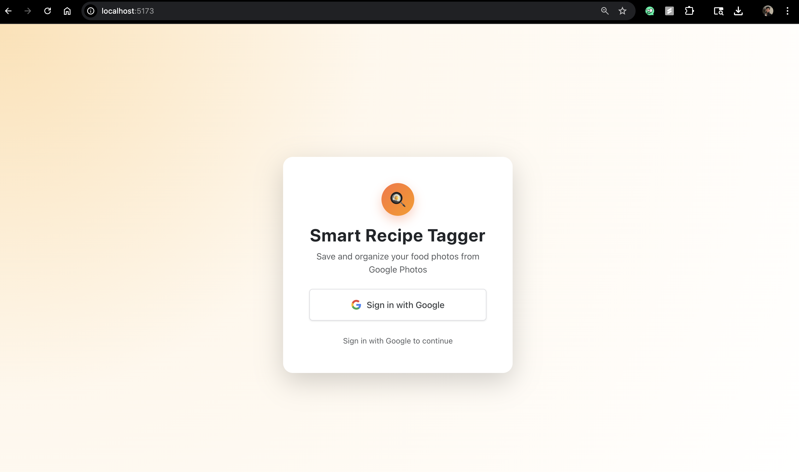

# 🍳 Smart Recipe Tagger

**Transform your food photos into delicious recipes with AI-powered analysis**

[](https://github.com/aryannnn17/Smart-Recipe-Tagger/blob/main/LICENSE)
[](https://github.com/aryannnn17/Smart-Recipe-Tagger/stargazers)
[](https://github.com/aryannnn17/Smart-Recipe-Tagger/network)

## 📋 Overview

Smart Recipe Tagger is an innovative web application that leverages artificial intelligence to transform your food photography into actionable recipes. By seamlessly integrating with Google Photos and utilizing cutting-edge AI technologies, our platform automatically analyzes food images, identifies ingredients, and generates comprehensive recipes with cooking instructions.

### 🎯 The Problem We Solve

Ever looked at your food photos and wondered exactly what ingredients were used or how to recreate that amazing dish? Smart Recipe Tagger bridges the gap between food photography and culinary creativity, making every food photo a potential recipe discovery.

### 💡 Our Solution

- **Intelligent Image Analysis**: Advanced computer vision identifies food items and ingredients
- **AI Recipe Generation**: Gemini AI creates detailed, step-by-step recipes
- **Seamless Integration**: Connect directly with your Google Photos library
- **Smart Organization**: Tag, search, and manage your recipe collection effortlessly

---

## 🚀 Key Features

### 🔐 **Secure Authentication**
- Google OAuth 2.0 integration for secure, single sign-on
- Privacy-first approach with no unnecessary data collection

### 📸 **Google Photos Integration**
- Direct access to your Google Photos library
- Smart filtering and organization of food-related images
- One-click photo selection for recipe analysis

### 🤖 **AI-Powered Analysis**
- **Google Vision API**: Advanced food recognition and ingredient identification
- **Gemini AI**: Intelligent recipe generation with cooking instructions
- **Nutritional Analysis**: Automatic calorie and nutrition information

### 📊 **Recipe Management**
- Comprehensive recipe cards with ingredients and instructions
- Smart tagging system for easy categorization
- Advanced search and filtering capabilities

### 📈 **Analytics Dashboard**
- Track your recipe discovery journey
- Visual insights into cooking patterns and preferences
- Personalized recommendations based on your history

### � **Responsive Design**
- Mobile-optimized interface for cooking on the go
- Progressive Web App capabilities
- Cross-platform compatibility

---

## 🛠️ Technology Stack

### Frontend
- **React 18** - Modern, component-based UI framework
- **Vite** - Lightning-fast build tool and development server
- **Bootstrap 5** - Professional, responsive UI components
- **Firebase SDK** - Real-time authentication and storage

### Backend
- **Node.js** - High-performance JavaScript runtime
- **Express.js** - Robust web application framework
- **MongoDB** - Scalable NoSQL database for recipe storage
- **Firebase Admin SDK** - Server-side authentication and cloud storage

### AI & APIs
- **Google Vision API** - Advanced image recognition and analysis
- **Gemini AI** - State-of-the-art language model for recipe generation
- **Google Photos API** - Secure photo library integration

### Infrastructure
- **Docker** - Containerized deployment
- **Google Cloud Run** - Scalable serverless hosting
- **Firebase Storage** - Secure file storage and CDN

---

## 📸 Live Demo

### 🔑 Authentication & Login


### 📊 Dashboard & Photo Gallery


### 🤖 AI Recipe Generation


### 📋 Recipe Details & Analysis


### 📈 Analytics & Insights


---

## 🚀 Getting Started

### Prerequisites
- Node.js 18+ and npm
- Google Cloud Project with enabled APIs
- Firebase project configuration
- MongoDB Atlas cluster

### Installation

1. **Clone the repository**
   ```bash
   git clone https://github.com/aryannnn17/Smart-Recipe-Tagger.git
   cd Smart-Recipe-Tagger
   ```

2. **Install dependencies**
   ```bash
   # Frontend dependencies
   cd client
   npm install
   
   # Backend dependencies
   cd ../server
   npm install
   ```

3. **Configure environment variables**
   ```bash
   # Copy the example environment file
   cd server
   cp .env.example .env
   
   # Edit .env with your credentials
   nano .env
   ```

4. **Add Firebase service account key**
   ```bash
   # Place your Firebase service account key in the server directory
   # Filename should match: smart-recipe-tagger-[project-id]-firebase-adminsdk-[key].json
   ```

5. **Start the development servers**
   ```bash
   # Start backend server (terminal 1)
   cd server
   npm start
   
   # Start frontend development server (terminal 2)
   cd client
   npm run dev
   ```

6. **Access the application**
   - Frontend: http://localhost:5173
   - Backend API: http://localhost:4000

---

## ⚙️ Configuration

### Required Environment Variables

```env
# Firebase Configuration
FIREBASE_PROJECT_ID=your-project-id
FIREBASE_CLIENT_ID=your-client-id
FIREBASE_API_KEY=your-api-key

# Google APIs
GOOGLE_VISION_API_KEY=your-vision-api-key
GEMINI_API_KEY=your-gemini-api-key

# Database
MONGODB_URI=your-mongodb-connection-string

# OAuth Configuration
GOOGLE_CLIENT_ID=your-google-client-id
GOOGLE_CLIENT_SECRET=your-google-client-secret
```

### API Setup

1. **Enable Google Cloud APIs**
   - Google Vision API
   - Gemini AI API
   - Google Photos API

2. **Configure OAuth 2.0**
   - Set up consent screen in Google Cloud Console
   - Create OAuth 2.0 credentials
   - Add authorized redirect URIs

---

## 📦 Deployment

### Docker Deployment

```bash
# Build and run with Docker
docker build -t smart-recipe-tagger .
docker run -p 4000:4000 smart-recipe-tagger
```

### Google Cloud Run

```bash
# Deploy to Google Cloud Run
gcloud builds submit --tag gcr.io/your-project-id/smart-recipe-tagger
gcloud run deploy --image gcr.io/your-project-id/smart-recipe-tagger --platform managed
```

For detailed deployment instructions, see [DEPLOYMENT.md](./DEPLOYMENT.md).

---

## 🤝 Contributing

We welcome contributions! Please see our [Contributing Guidelines](CONTRIBUTING.md) for details.

### Development Workflow
1. Fork the repository
2. Create a feature branch (`git checkout -b feature/amazing-feature`)
3. Commit your changes (`git commit -m 'Add amazing feature'`)
4. Push to the branch (`git push origin feature/amazing-feature`)
5. Open a Pull Request

---

## 📄 License

This project is licensed under the MIT License - see the [LICENSE](LICENSE) file for details.

---

## 📞 Contact & Support

**Developer:** Aryan Bhagat  
**Email:** aryanbhagat5702@gmail.com  
**GitHub:** [@aryannnn17](https://github.com/aryannnn17)

### 🐛 Bug Reports & Feature Requests
- Open an issue on GitHub for bug reports
- Use the "Feature Request" template for new ideas
- Join our discussions for community support

---

## ⚠️ Important Notes

### Google OAuth Verification
This application uses Google OAuth for authentication. During development, you may see a "Google hasn't verified this app" warning. This is normal for development applications. Click "Advanced" → "Go to [App Name] (unsafe)" to proceed.

### Data Privacy
- We only access the photos you explicitly select
- No data is shared with third parties
- All recipe data is stored securely in your personal database

---

## 🙏 Acknowledgments

- **Google Cloud** - Vision API and Gemini AI
- **Firebase** - Authentication and cloud storage
- **MongoDB** - Database services
- **React & Bootstrap** - UI frameworks
- **OpenAI** - AI model insights and inspiration

---

<div align="center">

**⭐ Star this repository if it helped you!**

Made with ❤️ by [Aryan Bhagat](https://github.com/aryannnn17)

</div>
